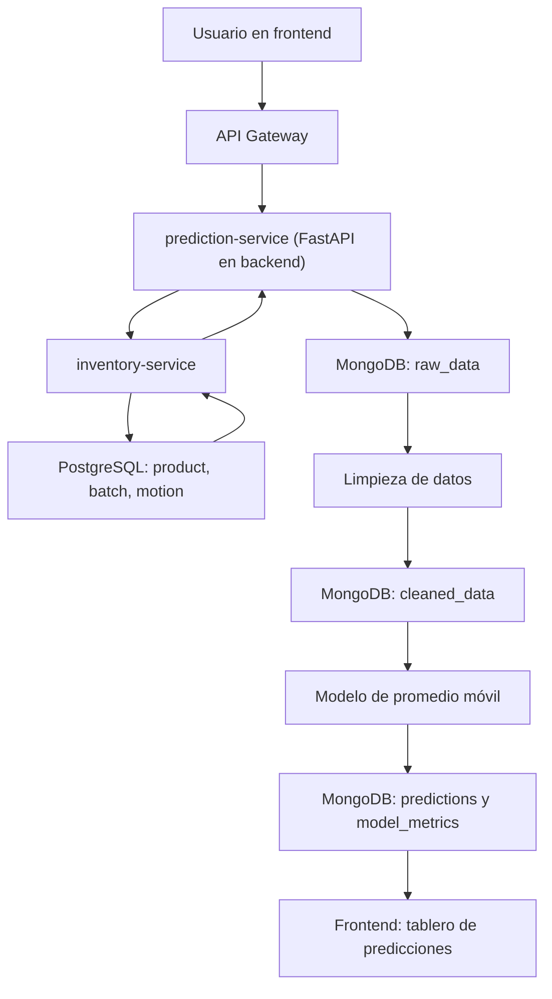

# ABP - FarmaExpres

## 1. Identificación del Proyecto

**Nombre del proyecto:** FarmaExpres  
**Tipo de sistema:** Aplicación web para gestión de inventario farmacéutico  
**Arquitectura:** Frontend React, API Gateway, microservicios backend, PostgreSQL, MongoDB, servicio predictivo Python y Docker
**Roles funcionales:** Administrador, Farmacéutico y Auditor

FarmaExpres es un sistema orientado a la operación de una farmacia. Permite administrar usuarios, autenticar accesos, gestionar medicamentos, controlar entradas y salidas de inventario, consultar movimientos, visualizar alertas, generar reportes, revisar auditoría y usar un módulo predictivo NoSQL para apoyar decisiones de reposición.

Este documento ABP resume el alcance actual del proyecto con base en los repositorios de backend, frontend y documentación. El módulo predictivo NoSQL ya no se ejecuta como un repositorio aparte para la operación local; quedó integrado dentro del `docker-compose.yml` del backend como `prediction-service` y `mongo`.

## 2. Problema Abordado

Una farmacia necesita saber qué medicamentos tiene, cuántas unidades hay disponibles, qué lotes están próximos a vencer, quién realiza cada movimiento y qué productos pueden agotarse pronto. Cuando esta información se maneja de forma manual o dispersa, aparecen problemas como pérdida de trazabilidad, errores de stock, ventas de productos vencidos, falta de control por rol y decisiones tardías de reposición.

FarmaExpres aborda este problema con una solución web distribuida. El sistema centraliza la operación diaria y, adicionalmente, incorpora un servicio predictivo NoSQL dentro del stack del backend para transformar movimientos históricos en información sencilla y entendible sobre demanda y riesgo de agotamiento.

## 3. Pregunta Guía

¿Cómo puede FarmaExpres controlar el inventario farmacéutico, mantener trazabilidad por usuario y anticipar necesidades de reposición usando una arquitectura de microservicios con bases de datos relacional y no relacional?

## 4. Objetivo General

Desarrollar un sistema web distribuido para la gestión de inventario farmacéutico, con control de usuarios, medicamentos, stock, movimientos, alertas, reportes, auditoría y análisis predictivo básico apoyado en MongoDB.

## 5. Objetivos Específicos

- Implementar autenticación de usuarios mediante JWT y refresh token.
- Gestionar usuarios y roles desde la interfaz administrativa.
- Registrar, consultar, actualizar y desactivar medicamentos.
- Controlar entradas y salidas de inventario con validaciones de stock.
- Registrar trazabilidad de movimientos por usuario, fecha, lote y motivo.
- Visualizar alertas de productos vencidos, próximos a vencer, con bajo stock y agotados.
- Generar reportes operativos de inventario, movimientos, vencimientos, bajo stock y actividad por usuario.
- Implementar auditoría para revisar históricos, inconsistencias, observaciones y métricas.
- Centralizar el acceso a servicios mediante API Gateway.
- Versionar la base relacional con Liquibase.
- Incorporar MongoDB para almacenar datos crudos, datos limpios, métricas y predicciones.
- Estimar demanda futura y riesgo de agotamiento con un modelo predictivo inicial.

## 6. Alcance Implementado

### 6.1 Frontend

El frontend está implementado con React y Vite. La estructura está organizada por módulos funcionales:

- Autenticación.
- Dashboard.
- Gestión de usuarios.
- Gestión de medicamentos.
- Entradas de inventario.
- Salidas de inventario.
- Movimientos.
- Alertas.
- Reportes.
- Control de stock.
- Auditoría.
- Predicciones de inventario.
- Layout y componentes compartidos.

La navegación se adapta al rol autenticado:

| Rol | Módulos visibles implementados |
| --- | --- |
| Administrador | Dashboard, Medicamentos, Usuarios, Movimientos, Reportes, Alertas, Control de stock y Predicciones |
| Farmacéutico | Dashboard, Inventario, Entradas, Salidas, Alertas, Control de stock y Predicciones en modo consulta |
| Auditor | Dashboard, Inventario, Movimientos, Reportes, Auditoría y Predicciones |

### 6.2 Backend Relacional

El backend principal está organizado en microservicios:

| Servicio | Responsabilidad |
| --- | --- |
| `api-gateway` | Punto de entrada, validación JWT, enrutamiento y fallbacks |
| `auth-service` | Autenticación, usuarios, roles, refresh token, logout y bitácora |
| `inventory-service` | Medicamentos, lotes, movimientos, entradas, salidas, reportes y snapshot analítico |
| `alert-service` | Alertas de inventario consumiendo información de inventario |
| `audit-service` | Historial de auditoría, inconsistencias, observaciones, métricas y casos manuales |

La persistencia relacional usa PostgreSQL y Liquibase por dominio: autenticación, inventario y auditoría.

### 6.3 Servicio NoSQL Predictivo

El módulo predictivo se implementa como un servicio Python con FastAPI y MongoDB dentro del repositorio del backend. No reemplaza los microservicios principales; los complementa para análisis. En Docker se levanta en el mismo proyecto del backend junto con PostgreSQL, `api-gateway`, `inventory-service`, `auth-service`, `audit-service` y `alert-service`.

Responsabilidades principales:

- Recibir datos desde `inventory-service`.
- Guardar datos crudos en MongoDB.
- Limpiar y normalizar registros.
- Calcular demanda esperada de medicamentos.
- Estimar riesgo de agotamiento.
- Exponer predicciones por API.
- Mostrar resultados en el frontend principal.

Control por rol:

| Rol | Permiso en predicciones |
| --- | --- |
| Administrador | Consulta resultados y ejecuta sincronización, limpieza y entrenamiento |
| Auditor | Consulta resultados y ejecuta sincronización, limpieza y entrenamiento |
| Farmacéutico | Consulta el tablero y las predicciones, sin ejecutar procesos de carga o entrenamiento |

## 7. Proceso Relacional a NoSQL

El flujo usado evita que el servicio predictivo consulte directamente las tablas de PostgreSQL. La propiedad de los datos de inventario se respeta a través de `inventory-service`, y el acceso externo se concentra en `api-gateway`.



Datos tomados del backend relacional:

- `product`: medicamento, código, categoría, stock, precio y stock mínimo.
- `batch`: lotes, fecha de vencimiento y stock disponible.
- `motion`: entradas y salidas de inventario.

Como el proyecto aún no cuenta con una tabla formal de ventas u órdenes, las salidas de inventario (`Exit`) se usan como aproximación de demanda.

## 8. Tratamiento de Datos

El tratamiento de datos se realiza antes de entrenar o recalcular predicciones:

1. Sincronizar datos desde `inventory-service`.
2. Guardar una copia cruda en `raw_data`.
3. Eliminar duplicados.
4. Validar identificadores de producto.
5. Validar cantidades nulas, negativas o inválidas.
6. Normalizar nombres de medicamentos.
7. Convertir fechas a formato estándar.
8. Marcar registros incompletos con banderas de calidad.
9. Guardar registros procesados en `cleaned_data`.
10. Calcular predicciones y guardar métricas.

Colecciones MongoDB:

| Colección | Uso |
| --- | --- |
| `raw_data` | Datos crudos sincronizados desde inventario |
| `cleaned_data` | Datos validados y normalizados |
| `products_snapshot` | Estado relevante de productos y stock |
| `predictions` | Resultado del modelo por medicamento |
| `model_metrics` | Métricas de limpieza y entrenamiento |

## 9. Modelo Predictivo

El modelo inicial usa un enfoque estadístico simple: promedio móvil de 30 días.

Proceso:

1. Agrupa salidas de inventario por medicamento.
2. Suma las salidas recientes de los últimos 30 días.
3. Calcula demanda diaria promedio.
4. Proyecta la demanda para los próximos 7 días.
5. Compara demanda proyectada contra stock disponible.
6. Clasifica el riesgo:
   - `OUT_OF_STOCK`: producto agotado.
   - `HIGH`: la demanda esperada puede superar el stock disponible.
   - `MEDIUM`: el stock está por debajo o cerca del mínimo.
   - `LOW`: no se detecta riesgo inmediato.

Este modelo es explicable y adecuado para una primera versión. No pretende ser un modelo avanzado de ciencia de datos; sirve como base funcional para demostrar extracción, limpieza, almacenamiento NoSQL y predicción inicial.

## 10. Funcionalidades Implementadas

### 10.1 Autenticación y Sesión

- Inicio de sesión con correo y contraseña.
- Generación de JWT y refresh token.
- Protección de rutas privadas.
- Cierre de sesión.

Endpoints principales:

- `POST /api/auth/login`
- `POST /api/auth/refresh`
- `POST /api/auth/logout`

### 10.2 Gestión de Usuarios

Permite consultar, crear, actualizar, cambiar contraseña, bloquear, desbloquear y desactivar usuarios.

Endpoints principales:

- `GET /api/users`
- `POST /api/users`
- `PUT /api/users/{id}/update`
- `PUT /api/users/{id}/password`
- `PUT /api/users/{id}/block`
- `PUT /api/users/{id}/unlock`
- `DELETE /api/users/{id}`

### 10.3 Medicamentos e Inventario

Permite administrar medicamentos, lotes, inventario activo, resumen de stock y consulta FEFO.

Endpoints principales:

- `GET /api/products`
- `GET /api/products/all`
- `GET /api/products/{id}`
- `GET /api/products/active`
- `GET /api/products/active-table`
- `GET /api/products/active-summary`
- `GET /api/products/fefo-snapshot`
- `POST /api/products`
- `PUT /api/products/{id}`
- `DELETE /api/products/{id}`
- `GET /api/products/{productId}/batches`
- `POST /api/products/{productId}/batches`

### 10.4 Entradas y Salidas

El sistema permite registrar entradas y salidas desde el frontend. Las salidas descuentan stock y se registran como movimientos.

Endpoints principales:

- `POST /api/movements/entries`
- `POST /api/movements/exits`
- `POST /api/movements/consume-fefo`

### 10.5 Alertas y Reportes

Incluye alertas de productos vencidos, próximos a vencer, bajo stock y agotados. También incluye reportes operativos para inventario, movimientos, vencimientos, bajo stock y usuarios.

### 10.6 Auditoría

El módulo de auditoría permite revisar historial, inconsistencias, observaciones, métricas y casos manuales para el rol Auditor.

### 10.7 Predicciones

El módulo `Predicciones` muestra:

- Estado del microservicio.
- Conteo de datos crudos, limpios y predicciones.
- Botones para sincronizar, limpiar y recalcular.
- Demanda esperada por medicamento.
- Riesgo de agotamiento.
- Prioridad de reposición.
- Métricas de limpieza y entrenamiento.

Endpoints principales:

- `GET /api/predictions/health`
- `POST /api/predictions/ingest`
- `POST /api/predictions/clean`
- `POST /api/predictions/train`
- `POST /api/predictions/recalculate`
- `GET /api/predictions`
- `GET /api/predictions/{productId}`
- `GET /api/predictions/metrics`

## 11. Tecnologías Implementadas

### Frontend

- React.
- Vite.
- React Router.
- Axios.
- Tailwind CSS.
- ESLint.
- Docker y Nginx.

### Backend

- Java 17.
- Spring Boot.
- Spring Security.
- Spring Data JPA.
- Spring Cloud Gateway.
- Resilience4j.
- JWT.
- Node.js y Express.
- PostgreSQL.
- Liquibase.
- Docker Compose.

### Módulo Predictivo

- Python.
- FastAPI.
- MongoDB.
- PyMongo.
- Promedio móvil como modelo inicial.
- Docker Compose integrado en el backend.

### Despliegue por ambiente

El despliegue local integrado se realiza con dos repositorios operativos: backend y frontend. El backend levanta también MongoDB y `prediction-service`; por eso ya no se debe entrar a un repositorio aparte para ejecutar el módulo NoSQL.

```bash
cd FarmaExpres_Backend
docker compose --env-file .env.dev up -d --build

cd ../FarmaExpres-Frontend/frontend
docker compose --env-file .env.dev up -d --build
```

Para `qa` o `main`, se reemplaza `.env.dev` por `.env.qa` o `.env.main` en ambos repositorios. Si se reconstruye el backend, se recomienda reconstruir después el frontend para que el contenedor web quede conectado a la red Docker actual del ambiente.

Organización esperada en Docker Desktop:

```text
farmaexpres-dev
  postgres
  auth-service
  inventory-service
  audit-service
  alert-service
  api-gateway
  prediction-service
  mongo

farmaexpres-frontend-dev
  frontend
```

Puertos principales:

| Ambiente | Frontend | Gateway | API predictiva directa | MongoDB |
| --- | --- | --- | --- | --- |
| dev | `3000` | `8080` | `8085` | `27017` |
| qa | `4000` | `9080` | `9085` | `37017` |
| main | `5000` | `10080` | `10085` | `47017` |

## 12. MoSCoW del Alcance Actual

| Categoría | Elementos |
| --- | --- |
| Must have | Autenticación, inventario, movimientos, alertas, reportes, auditoría, Docker, gateway, PostgreSQL y MongoDB |
| Should have | Predicciones de demanda, limpieza de datos, métricas, tablero integrado y documentación de flujo NoSQL |
| Could have | Modelos más avanzados, estacionalidad, evaluación con históricos más amplios y comparación entre algoritmos |
| Won't have por ahora | Aplicación móvil, integración con proveedores externos, facturación formal y predicción productiva certificada |

## 13. Historias Relacionadas

- `HU-MDRT-001`: control de concurrencia en movimientos de inventario.
- `HU-MDRT-002`: integración del microservicio predictivo NoSQL, gateway e ingesta desde inventario.
- `HU-MDRT-003`: visualización de predicciones dentro del frontend principal.

## 14. Evidencias en Repositorios

| Repositorio | Evidencia |
| --- | --- |
| Backend | Gateway, snapshot analítico, Docker, Liquibase, pruebas y documentación por HU |
| Frontend | Módulo `Predicciones`, permisos por rol, consumo por gateway y documentación por HU |
| Backend predictivo | `prediction-service`, MongoDB, limpieza, predicción, métricas, Docker Compose integrado y documentación por HU |
| Documentación | ABP, requerimientos, guías y documentos funcionales |

## 15. Resultado del Proyecto

FarmaExpres queda como una aplicación web funcional para gestión farmacéutica con arquitectura distribuida. El sistema controla inventario, usuarios, movimientos, alertas, reportes y auditoría. Además, incorpora un módulo NoSQL predictivo que transforma movimientos históricos en alertas de demanda y riesgo de agotamiento, manteniendo la integración con el backend principal mediante API Gateway e `inventory-service`.
